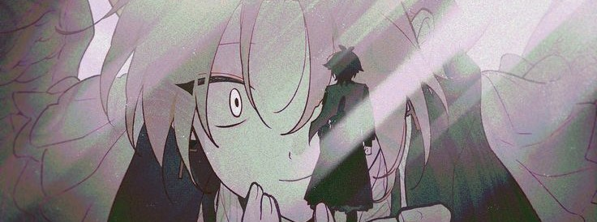
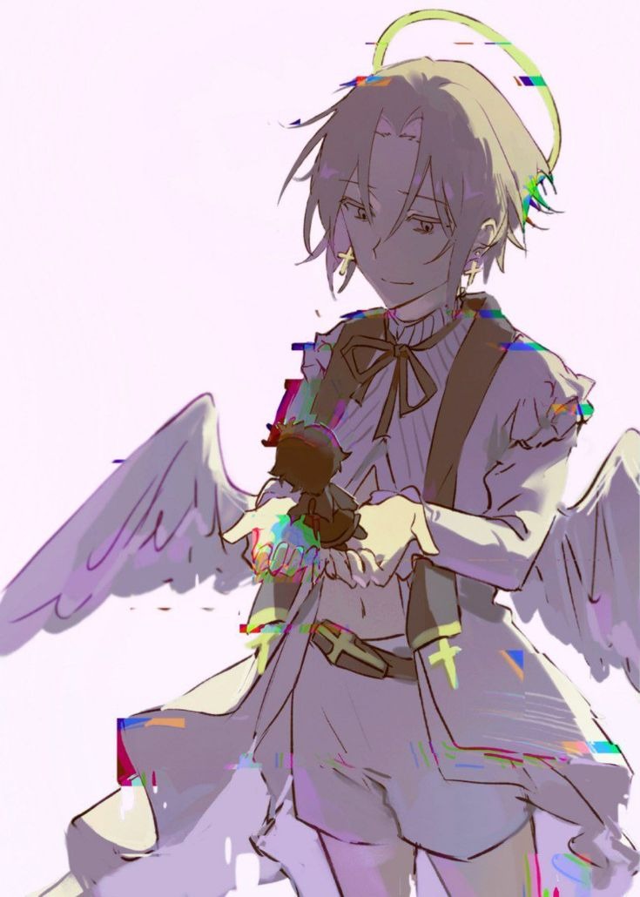

 

𝚜𝚎𝚎 𝚑𝚘𝚠 𝚝𝚑𝚎 𝚋𝚛𝚊𝚒𝚗 𝚙𝚕𝚊𝚢𝚜 𝚊𝚛𝚘𝚞𝚗𝚍.

𝚊𝚗𝚍 𝚢𝚘𝚞 𝚏𝚊𝚕𝚕 𝚒𝚗𝚜𝚒𝚍𝚎 𝚊 𝚑𝚘𝚕𝚎 𝚢𝚘𝚞 𝚌𝚘𝚞𝚕𝚍𝚗'𝚝 𝚜𝚎𝚎

<table>
<tr>
 
✦ 𝙖𝙗𝙤𝙪𝙩 𝙢𝙚 

> 𝙣𝙞𝙠𝙠𝙞 
> 𝟭𝟴 𝙮.𝙤. | 𝙗𝙙𝙖𝙮 𝟯𝟭.𝟭𝟮.  
> 𝙨𝙥𝟳𝙨𝙤𝟮𝙨𝙥𝟴 | 𝟳𝙬𝟴 
> 𝙀𝙉𝙁𝙋 
> 𝙨𝙖𝙣𝙦𝙪𝙞𝙣𝙚-𝙢𝙚𝙡𝙖𝙣𝙘𝙝𝙤𝙡𝙞𝙘  
> 𝙑𝙀𝙇𝙁 | 𝙄𝙀𝙀 
 

୨୧   ⎯    ┈   ʚ   ✧   ɞ    ┈    ⎯   ୨୧

 
✦ 𝙢𝙖𝙞𝙣 𝙛𝙖𝙣𝙙𝙤𝙢𝙨 

> 𝙗𝙨𝙙, 𝙯𝙚𝙣𝙤 𝙧𝙚𝙢𝙖𝙠𝙚, 𝙝𝙚𝙡𝙡𝙤 𝙘𝙝𝙖𝙧𝙡𝙤𝙩𝙩𝙚, 𝙤𝙢𝙤𝙧𝙞, 𝙨𝙝𝙩𝙙𝙣, 𝙮𝙩𝙩𝙙, 𝙗𝙖𝙘𝙠𝙧𝙤𝙤𝙢𝙨, 𝙧𝙤𝙗𝙡𝙤𝙭(𝙥𝙧𝙚𝙨𝙨𝙪𝙧𝙚, 𝙙𝙖𝙣𝙙𝙮 𝙬𝙤𝙧𝙡𝙙, 𝙛𝙤𝙧𝙨𝙖𝙠𝙚𝙣, 𝙡𝙚𝙩 𝙝𝙞𝙢 𝙜𝙤, 𝙙𝙪𝙖𝙡𝙞𝙩𝙮, 𝙣𝙪𝙡𝙡𝙨𝙘𝙖𝙥𝙚, 𝙜𝙧𝙖𝙘𝙚, ^_^, 𝙟𝙞𝙢𝙨 𝙘𝙤𝙢𝙥𝙪𝙩𝙚𝙧, 𝙙𝙚𝙭𝙨 𝙥𝙖𝙧𝙩𝙮, 𝙗𝙖𝙙 𝙩𝙝𝙞𝙣𝙜𝙨, 𝙖𝙣𝙞𝙢𝙖𝙡 𝙝𝙤𝙨𝙥𝙞𝙩𝙖𝙡, 𝙢.𝙚.𝙜., 𝙙𝙧𝙖𝙬𝙣𝙤𝙪𝙩, 𝙗𝙧𝙤𝙠𝙚𝙣 𝙙𝙧𝙚𝙖𝙢, 𝙥𝙞𝙯𝙯𝙖 𝙜𝙖𝙢𝙚), 𝙩𝙝𝙚 𝙨𝙪𝙢𝙢𝙚𝙧 𝙝𝙞𝙠𝙖𝙧𝙪 𝙙𝙞𝙚𝙙, 𝙢𝙞𝙣𝙚𝙘𝙧𝙖𝙛𝙩, 𝙩𝙖𝙙𝙘, 𝙜𝙚𝙣𝙨𝙝𝙞𝙣. 
 

୨୧   ⎯    ┈   ʚ   ✧   ɞ    ┈    ⎯   ୨୧

 
✦ 𝙙𝙣𝙞 

> 𝟭𝟰 𝙮.𝙤., 𝙧𝙖𝙘𝙞𝙨𝙢, 𝙝𝙤𝙢𝙤𝙥𝙝𝙤𝙗𝙞𝙖, 𝙖𝙣𝙮𝙩𝙝𝙞𝙣𝙜 -𝙥𝙝𝙞𝙡𝙞𝙖, 𝙖𝙗𝙡𝙚𝙞𝙨𝙩𝙨 
 

୨୧   ⎯    ┈   ʚ   ✧   ɞ    ┈    ⎯   ୨୧

 

✦ 𝙗𝙮𝙞 
> 𝙞 𝙝𝙖𝙫𝙚 𝙤𝙨𝙙𝙙. 𝙞𝙩 𝙘𝙖𝙣 𝙖𝙛𝙛𝙚𝙘𝙩 𝙢𝙚𝙢𝙤𝙧𝙮, 𝙚𝙢𝙤𝙩𝙞𝙤𝙣𝙨, 𝙖𝙣𝙙 𝙞𝙙𝙚𝙣𝙩𝙞𝙩𝙮. 𝙞𝙛 𝙩𝙝𝙖𝙩’𝙨 𝙖 𝙥𝙧𝙤𝙗𝙡𝙚𝙢, 𝙙𝙤 𝙣𝙤𝙩 𝙞𝙣𝙩𝙚𝙧𝙖𝙘𝙩.
 </tr>
    </table>

